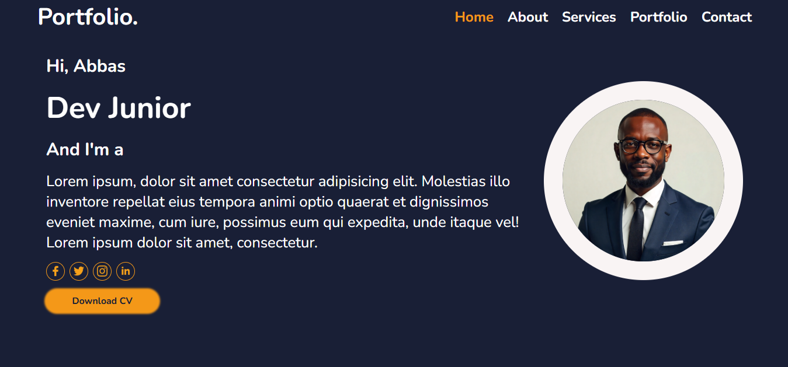
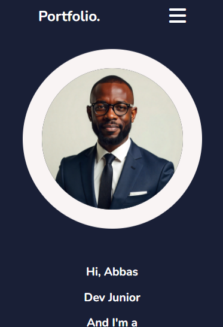

# 🚀 Portfolio

## Specificite


## 🌟 Aperçu du Projet

| Caractéristique | Implémentation |
| :--- | :--- |
| **Thème** | Sombre (`--bg-color`, `--snd-bg-color`) avec couleur d'accent **Orange** (`--main-color`). |
| **Typographie** | Police Nunito, utilisant la fonction **`clamp()`** pour un redimensionnement parfait des titres et paragraphes. |
| **Icônes** | Font Awesome (pour le menu burger) et Remixicon (pour le bouton "Retour en haut"). |
| **Architecture** | Entièrement **responsive** (adaptatif) grâce aux media queries et à l'utilisation stratégique de `flexbox`. |

## 🛠️ Points Forts et Techniques Clés

### 1\. Gestion de la Navigation Mobile (Le "Hack" du Menu Burger)

Le menu de navigation est masqué sur les petits écrans et révélé en cliquant sur l'icône "hamburger" (Font Awesome).

  * **Technique :** J'ai utilisé l'astuce classique en CSS (le **"Checkbox Hack"**). L'état coché de l'input masqué (`#menu-toggle`) est utilisé pour contrôler l'affichage de la liste (`ul`) via le sélecteur `~` (général sibling combinator).
  * **Code CSS clé (Media Query) :**

<!-- end list -->

```css
/* Cache la liste par défaut sur mobile */
ul {
    display: none;
    /* ... positionnement du menu ... */
}
/* Affiche le bouton burger */
label {
    display: block;
}
/* Affiche la liste quand la checkbox est cochée */
#menu-toggle:checked ~ ul {
    display: flex; /* ou display: block; */
}
```

### 2\. Effet Interactif des Services

La section `#services` présente des cartes de service avec un effet de survol pour engager l'utilisateur.

  * **Technique :** Les cartes (`.servicesDiv`) réagissent au survol avec une légère transformation et une lueur.
  * **Code CSS clé :**

<!-- end list -->

```css
.servicesDiv:hover {
    border: 1px solid var(--main-color);
    box-shadow: 0 0 1px 1px var(--main-color);
    transform: scale(1.02); /* Agrandit légèrement la carte */
}
```

### 3\. Effet de Superposition (Overlay) des Projets

La section `#myDoing` est conçue pour révéler les détails du projet uniquement lors du survol de l'image.

  * **Technique :** Un calque (`.overlay`) est positionné au-dessus de l'image. Il est initialement transparent et hors champ (`transform: translateY(100%)`). Au survol de la div parente, il remonte et un dégradé orange (`linear-gradient`) apparaît.
  * **Code CSS clé :**

<!-- end list -->

```css
/* Cache l'overlay initialement */
.overlay {
    transform: translateY(100%);
    opacity: 0;
    transition: all 0.5s ease;
}

/* Révèle l'overlay au survol du conteneur */
.imgMyDoing:hover .overlay {
    background: linear-gradient(to top, var(--main-color), transparent);
    transform: translateY(0);
    opacity: 1;
}
```

### 4\. Animation de l'Image d'Accueil

L'image de profil dans la section `#myself` n'est pas statique ; elle flotte pour donner un sentiment de dynamisme à la page.

  * **Technique :** Utilisation de l'animation CSS `@keyframes`.
  * **Code CSS clé :**

<!-- end list -->

```css
#myselfImg {
    animation: float 4s ease-in-out infinite;
}

@keyframes float {
    0%, 100% {
        transform: translateY(0);
    }
    50% {
        transform: translateY(-5vh); /* Déplace de 5% de la hauteur de la vue */
    }
}
```

-----

### Rendu 



### lien repo
[Repo Github](https://github.com?abbas001900/portfolio.git)
### lien github page
[Github page](https://abbas001900.github.io/portfolio/)
